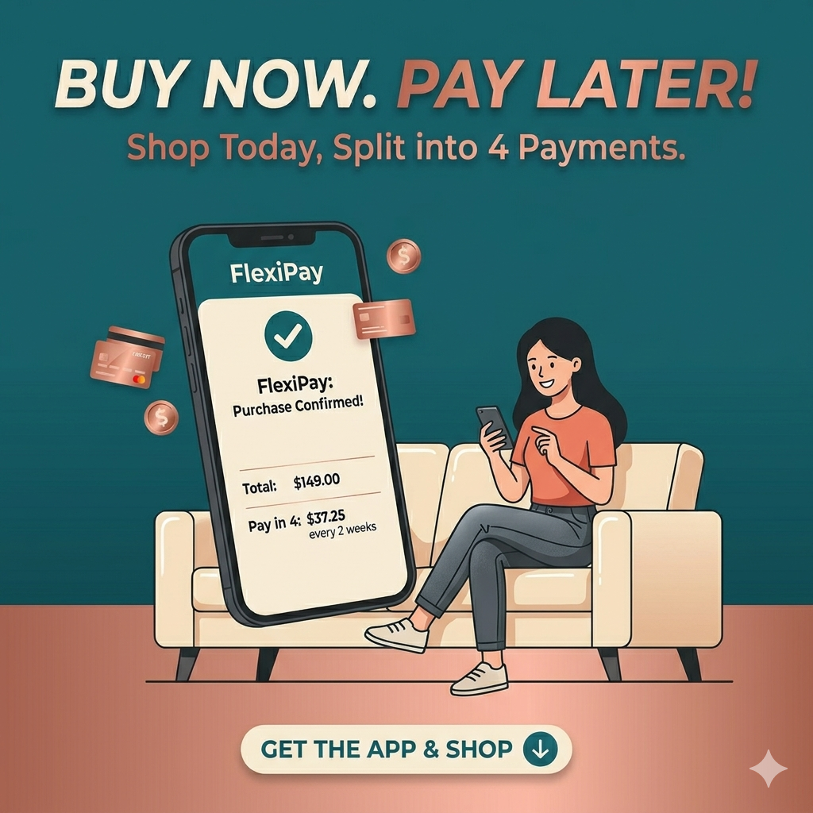

# Buy Now Pay Later Adoption and Delinquency Prediction using SHED data - a multi-model comparison



## Overview
This analysis utilizes data from the Federal Reserve’s Survey of Household Economics and Decisionmaking (SHED) for the years 2022–2025 to model the adoption and delinquency patterns of Buy Now, Pay Later (BNPL) users.
**Target Variables:**
BNPL Adoption: Derived from question BNPL1 ("In the past year, have you used a “Buy Now, Pay Later” service to buy something?")
BNPL Delinquency: Derived from question BNPL3 ("In the past year, have you ever been late making a payment for something you bought using a Buy Now, Pay Later service?")

**Predictive Features:**
The model relies on self-reported features across several financial and demographic dimensions:
Financial Well-being: Economic status, financial concerns, emergency fund availability, and savings behaviors.
Credit & Payment Habits: General payment behavior and credit card utilization.
Socio-demographics: Race, educational attainment, total household assets, and number of children under 18."

## Data
The analysis uses data from the following sources:
https://www.federalreserve.gov/consumerscommunities/shed_data.htm
- **Dataset 1**: 2022 Survey Data csv file
- **Dataset 2**: 2023 Survey Data cvs file
- **Dataset 2**: 2024 Survey Data cvs file
- **Dataset 2**: 2025 Survey Data cvs file

Due to inconsistencies in survey IDs and answers across the four years, data processing was performed to synchronize and merge the datasets.

## Variables

## Codebook

Here are all of the variables shared across the four surveys. I verified that the codes correspond to the same questions in each version. Some items, such as BNPL 4 represent multiple responses to a single question and thus take up more than one column.

**Independent variables candidates - Demographics and general questions**


| Variable name | Description |
|---|---|
| A6 | If you were to apply for a credit card today, how confident are you that your application would be approved? |
| B3 | Compared to 12 months ago, would you say that you (and your family) are better off, the same, or worse off financially? |
| BNPL1 | In the past year, have you used a “Buy Now Pay Later” service to buy something? |
| BNPL3 | In the past year, have you ever been late making a payment for something you bought using a Buy Now Pay Later service? |
| C4A |In the past 12 months, how frequently have you carried an unpaid balance on one or more of your credit cards? |
| EF1 | Have you set aside emergency or rainy day funds that would cover your expenses for 3 months in case of sickness, job loss, economic downturn, or other emergencies? |
| I20 | In the past month, would you say that your and your spouse’s or partner’s total spending was more or less than your income? |

|I41_c|In the past 12 months, have you or your spouse recieved Women, Infants, and Children (WIC) nutrition program benefits?|
|I41_e|In the past 12 months, have you or your spouse recieved free or reduced price school lunches for your children?|
|L0C|How many children do you have who are under age 18 and currently live with you?|
|ppage|Age (discrete number of years)|
|ppethm|Race/ethnicity|
|ppeducat|What is your highest level of eductation?|
|ppemploy|Current employment status|
|ppfs0596| What is the approximate total amount of your household's savings and investments?|
|ppfs1482|Where do you think your credit score falls?|
|pphhsize|Household size|
|ppinc7|Total household income (categorical, e.g. $10K-$24,999, $25K-$34,999)|
|ppkid017|Presence of children in the household|
|ppmarit5|Marital status|
|EF1|Have you set aside emergency or rainy day funds that would cover your expenses for 3 months in case of sickness, job loss, economic downturn, or other emergencies?|
|EF5C (available 2023-2024 data)|Other than any credit card bills you may have, did you pay all your bills in full last month?|Available 2023-2024 |


**EF3a-h are all possible responses to the following question: Suppose that you have an emergency expense that costs ($400/$500). Based on your current financial situation, how would you pay for this expense?**

|Variable name|Description|
|---|---|
|EF3_a|Put it on my credit card and pay it off in full at the next statement|
|EF3_b|Put it on my credit card and pay it off over time|
|EF3_c|With the money currently in my checking/savings account or with cash|
|EF3_d|Using money from a bank loan or line of credit|
|EF3_e|By borrowing from a friend or family member|
|EF3_f|Using a payday loan, deposit advance, or overdraft|
|EF3_g|By selling something|
|EF3_h|I wouldn't be able to pay for the expense right now|

**X12a-g (only available for 2024 data) are all possible responses to the following question: Are each of the following a financial challenge or concern you or your family?**

|Variable name|Description|
|---|---|
|X12_a|Finding or keeping a job|
|X12_b|Increases in prices for things you buy|
|X12_c|Housing costs or availability|
|X12_d|Retirement savings|
|X12_e|Making ends meet|
|X12_f|Medical debt or affording medical care|
|X12_g|Student loans or education costs |

**A1a-c are all possible responses to the following question: In the past 12 months, has each of the following happened toyou?**

|Variable name|Description|
|---|---|
|A1_a|Turned down for credit|
|A1_b|Approved for credit, but were not given as much credit as you applied for |
|A1_c|Put off applying for credit because you thought you might be turned down|

**BNPL 4a-4f are all possible responses to the following question: Thinking about the most recent time you used a Buy Now Pay Later service, why did you choose to finance the purchase in this way?**

Note: only some of these are available in the 2021 dataset. The 2021 codebook includes 4b, 4c, and 4d.
|Variable name|Description|
|---|---|
|BNPL4_a|Avoid interest charges|
|BNPL4_b|Wanted to spread out payment|
|BNPL4_c|Wanted a fixed number of payments|
|BNPL4_d|Convenience|
|BNPL4_e|Only way I could afford it|
|BNPL4_f|Only accepted payment method I had|

## Predictors:
- [Feature 1]
- [Feature 2]
- [Feature 3]

## Target variables:
- BNPL1
- BNPLE

## Methods
Dimensionality reduction: Due to the size of predictive variables, PCA and step-wise feature selection are performed for dimension reduction

Modeling: We apply several statistical learning models, including:
- Logistic regression
- SVM
- XGBoost
- Deep Learning

Performance evaluation: model performance is evaluated using:
- RMSE and R² (regression)
- Accuracy, Recall and ROC-AUC (classification)

## Results
Key findings include:
- **[Insight 1]**
- **[Insight 2]**
- **[Insight 3]**

These results suggest that **[interpretation]**.

## Repository Structure
```text
├── data/               # Raw and processed datasets
├── image/              # Plots and images
├── src/                # Code
├── README.md           # Project documentation
