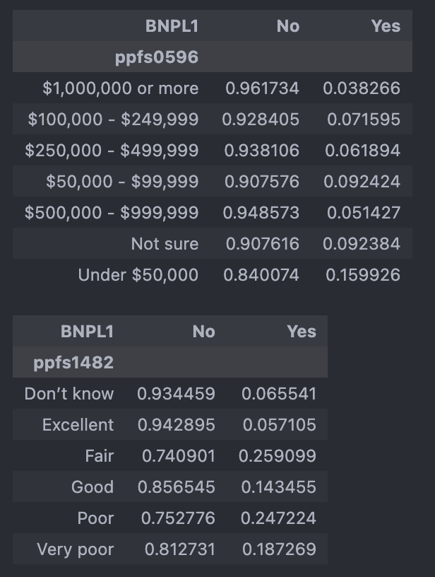
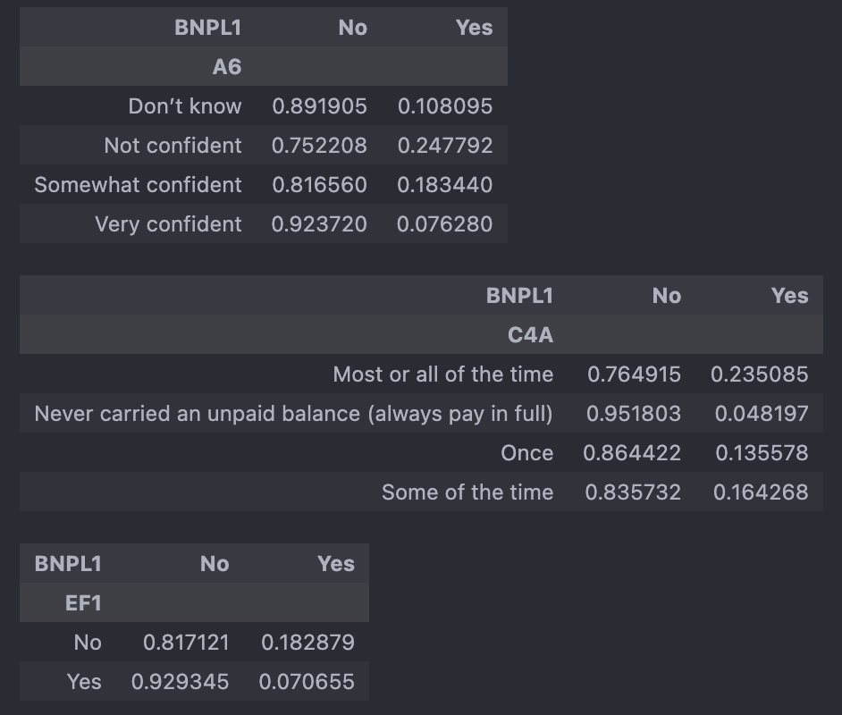
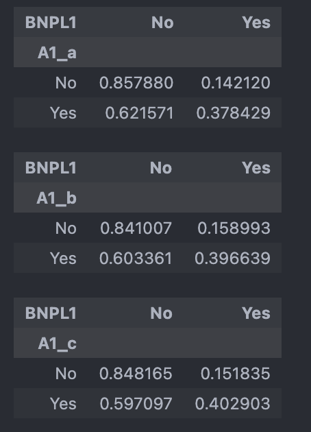
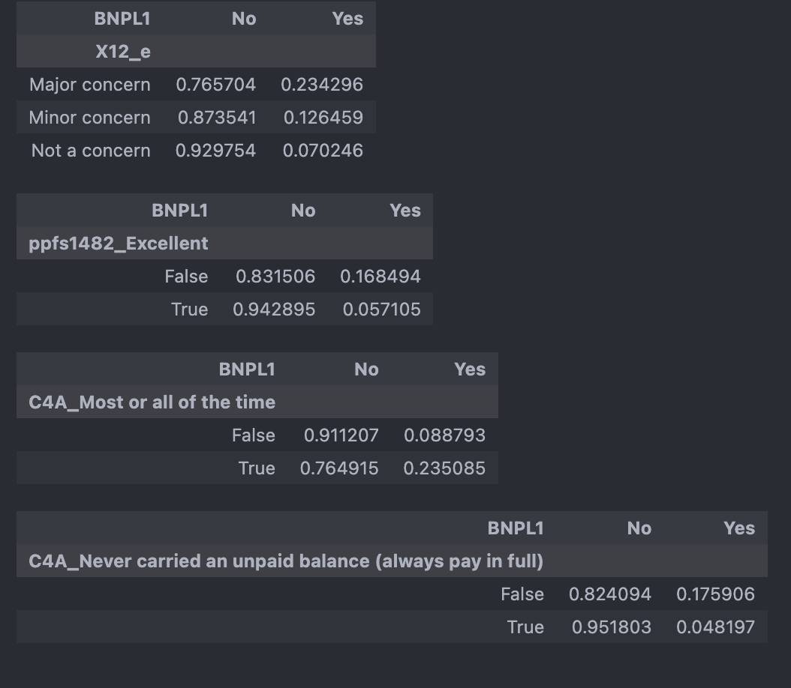
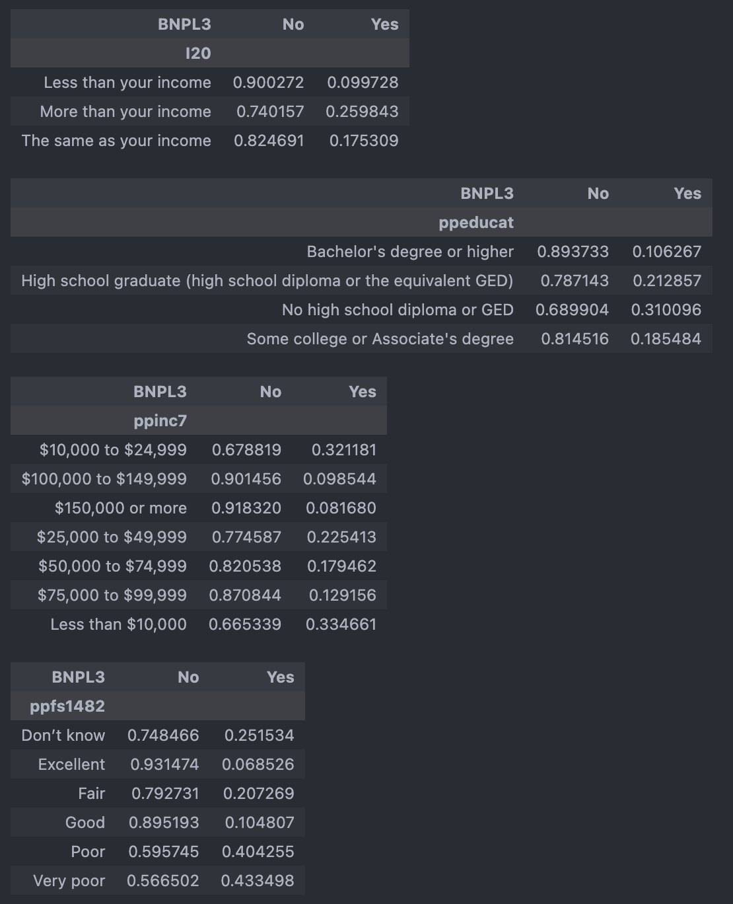
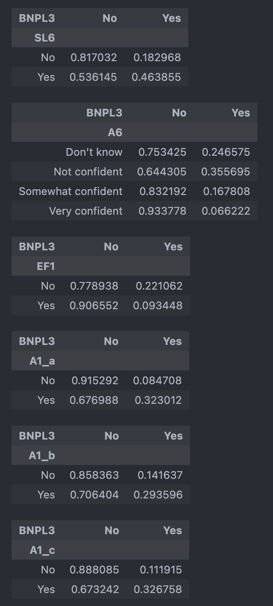
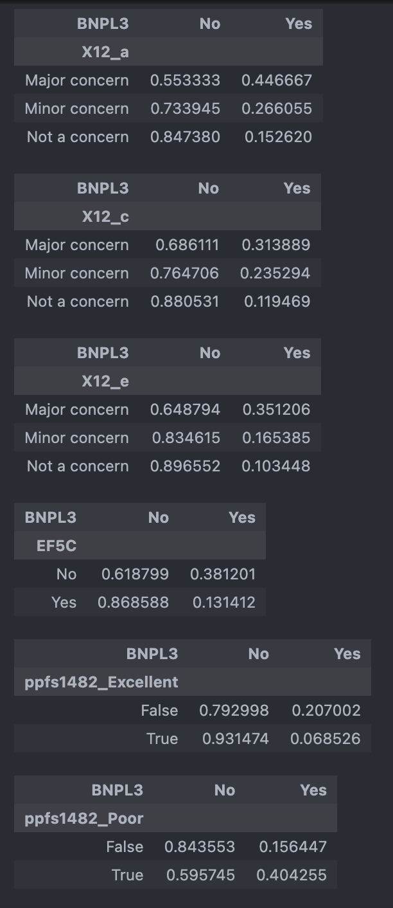

## Codebook

Here are all of the variables shared across the four surveys. I verified that the codes correspond to the same questions in each version. Some items, such as BNPL 4 represent multiple responses to a single question and thus take up more than one column.

**Independent variables candidates - Demographics and general questions**

|Variable name|Description|
|---|---|
|A6|If you were to apply for a credit card today, how confident are you that your application would be approved?|
|B3|Compared to 12 months ago, would you say that you (and your family) are better off, the same, or worse off financially?|
|BNPL1| In the past year, have you used a “Buy Now Pay Later” service to buy something?|
|BNPL3| In the past year, have you ever been late making a payment for something you bought using a Buy Now Pay Later service?|
|C4A|In the past 12 months, how frequently have you carried an unpaid balance on one or more of your credit cards?|
|EF1|Have you set aside emergency or rainy day funds that would cover your expenses for 3 months in case of sickness, job loss, economic downturn, or other emergencies?|
|I20|In the past month, would you say that your and your spouse’s or partner’s total spending was more or less than your income?|
|I41_c|In the past 12 months, have you or your spouse recieved Women, Infants, and Children (WIC) nutrition program benefits?|
|I41_e|In the past 12 months, have you or your spouse recieved free or reduced price school lunches for your children?|
|L0C|How many children do you have who are under age 18 and currently live with you?|
|ppage|Age (discrete number of years)|
|ppagecat|Age (categorical, e.g. 18-24, 25-34, etc.)|
|ppethm|Race/ethnicity|
|ppeducat|What is your highest level of eductation?|
|ppemploy|Current employment status|
|ppfs0596| What is the approximate total amount of your household's savings and investments?|
|ppfs1482|Where do you think your credit score falls?|
|pphhsize|Household size|
|ppinc7|Total household income (categorical, e.g. $10K-$24,999, $25K-$34,999)|
|ppkid017|Presence of children in the household|
|ppmarit5|Marital status|
|SL6|Are you behind on payments or in collections for one or more of the student loans from your own education?|
|EF1|Have you set aside emergency or rainy day funds that would cover your expenses for 3 months in case of sickness, job loss, economic downturn, or other emergencies?|
|EF5C (available 2023-2024 data)|Other than any credit card bills you may have, did you pay all your bills in full last month?|Available 2023-2024 |

**EF3a-h are all possible responses to the following question: Suppose that you have an emergency expense that costs ($400/$500). Based on your current financial situation, how would you pay for this expense?**

|Variable name|Description|
|---|---|
|EF3_a|Put it on my credit card and pay it off in full at the next statement|
|EF3_b|Put it on my credit card and pay it off over time|
|EF3_c|With the money currently in my checking/savings account or with cash|
|EF3_d|Using money from a bank loan or line of credit|
|EF3_e|By borrowing from a friend or family member|
|EF3_f|Using a payday loan, deposit advance, or overdraft|
|EF3_g|By selling something|
|EF3_h|I wouldn't be able to pay for the expense right now|

**X12a-g (only available for 2024 data) are all possible responses to the following question: Are each of the following a financial challenge or concern you or your family?**

|Variable name|Description|
|---|---|
|X12_a|Finding or keeping a job|
|X12_b|Increases in prices for things you buy|
|X12_c|Housing costs or availability|
|X12_d|Retirement savings|
|X12_e|Making ends meet|
|X12_f|Medical debt or affording medical care|
|X12_g|Student loans or education costs |

**A1a-c are all possible responses to the following question: In the past 12 months, has each of the following happened toyou?**

|Variable name|Description|
|---|---|
|A1_a|Turned down for credit|
|A1_b|Approved for credit, but were not given as much credit as you applied for |
|A1_c|Put off applying for credit because you thought you might be turned down|

**BNPL 4a-4f are all possible responses to the following question: Thinking about the most recent time you used a Buy Now Pay Later service, why did you choose to finance the purchase in this way?**

Note: only some of these are available in the 2021 dataset. The 2021 codebook includes 4b, 4c, and 4d.
|Variable name|Description|
|---|---|
|BNPL4_a|Avoid interest charges|
|BNPL4_b|Wanted to spread out payment|
|BNPL4_c|Wanted a fixed number of payments|
|BNPL4_d|Convenience|
|BNPL4_e|Only way I could afford it|
|BNPL4_f|Only accepted payment method I had|

#### High correlation columns
 - 1. With BNPL1:

| Variable | Question | Category | Correlation with BNPL1 | Spearman corr (p) | Chi^2 (p, cramers_v) |
|--------|-----|-----|-----|-----|-----|
| ppfs0596	| Household income and investment | | | -0.157546	(2.101884e-168) | 785.899053	(1.714126e-166,	0.157056)  |
| ppfs1482 | Where do you think your credit score falls? |  |  | | 2095.860225	(0.000000e+00,	0.228806)|
| ppage | age |  |  | -0.129598	(5.249315e-176) | |
| A6 | Confidence of credit card application approval | |  | | 1807.429243	(0.000000e+00	0.195611)|
| C4A | Frequency carried an unpaid balance on credit cards | |  | | 2409.108407	(0.000000e+00	0.244392V)|
| EF1 | Have you set aside emergency funds? | | |  | 1395.318197(2.186735e-305	0.171870)|
| A1_a | Turned on for credit in past 12 months | |  | | 1028.181904	(1.344683e-225	0.249273)|
| A1_b| Approved for credit, but were not given as much credit as you applied for in the past 12 months | | | | 774.527515	(1.863587e-170	0.216351)|
| A1_c | Put off applying for credit because you thought you might be turned down in the past 12 months |  |  | | 954.507724	(1.389561e-209	0.240176) |
| X12_e | Making ends meet - Are each of the following a financial challenge or concern for you or your family? | |  | | 228.753785	(2.122007e-50	0.193255) |
| ppfs1482_Excellent  | where do your credit score falls? |  | |  | 1413.792239	(2.115226e-309	0.173004) | |
| C4A_Most_or_all_of_the_time	 | In the past 12 months, how frequently have you carried an unpaid balance on one or more of your credit cards?  | |  | | 1511.582349	(0.000000e+00	0.178887) |
| C4A_Never carried an unpaid balance (always paid in full) | In the past 12 months, how frequently have you carried an unpaid balance on one or more of your credit cards? | |  | | 1857.842534	(0.000000e+00	0.198321)|

 - 2. With BNPL3:

| Variable | Question | Category | Correlation with BNPL1 | Spearman corr (p) | Chi^2 (p, cramers_v) |
|--------|-----|-----|-----|-----|-----|
| I20	| Spending higher/lower/same as income | | | | 153.998819	(3.627283e-34	0.167164)  |
| ppeducat	| Education | | |  | 127.669360	(1.719082e-27	0.152205)  |
| ppfs0596	| Household income and investment | | |  | 785.899053	(1.714126e-166,	0.157056)  |
| ppinc7 | Household income |  |  | -0.206426	(4.186553e-54) | 248.637921	(8.016644e-51	0.212407)|
| ppfs1482 | Where do you think your credit score falls? |  | |  | 414.660244	(2.051954e-87	0.309423) | |
| SL6 | Are you behind on payments or in collections for one or more of the student loans from your own education?  | |  | | 109.305151	(1.391303e-25	0.268339) |
| A6 | Confidence of credit car approval | |  | | 527.580377(5.026688e-114	0.309406) |
| EF1 | Have you set aside emergency funds? | | |  | 141.565359	(1.210373e-32	0.160274)|
| A1_a | Turned on for credit in past 12 months | |  | | 293.640910	(8.002979e-66	0.301094)|
| A1_b| Approved for credit, but were not given as much credit as you applied for in the past 12 months | | | | 103.896530	(2.131625e-24	0.179100)|
| A1_c | Put off applying for credit because you thought you might be turned down in the past 12 months |  |  | | 223.091585	(1.914480e-50	0.262444) |
| X12_a | Finding or keeping a job - Are each of the following a financial challenge or concern you or your family?  | |  | | 54.618626	(1.379482e-12	0.260156) |
| X12_c | Increases in prices for things you buy - Are each of the following a financial challenge concern for you or your family?  | |  | | 28.956009	(5.155639e-07	0.189423) |
| X12_e | Making ends meet - Are each of the following a financial challenge or concern for you or your family? | |  | | 51.299939	(7.250364e-12	0.252128) |
| EF5C	 | Other than any credit card bills you may have, did you pay all your bills in full last month?   | |  | | 230.371682	(4.946355e-52	0.271512) |
| ppfs1482_Excellent | Excellent credit scores | |  | | 127.502275	(1.442355e-29	0.152105)|
| ppfs1482_Poor | Poor credit scores | |  | | 164.054165	(1.472072e-37	0.172535)|

